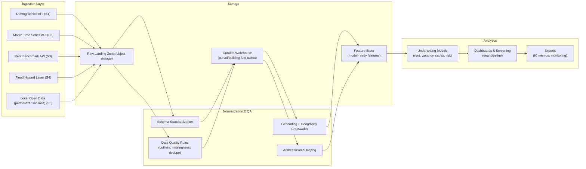
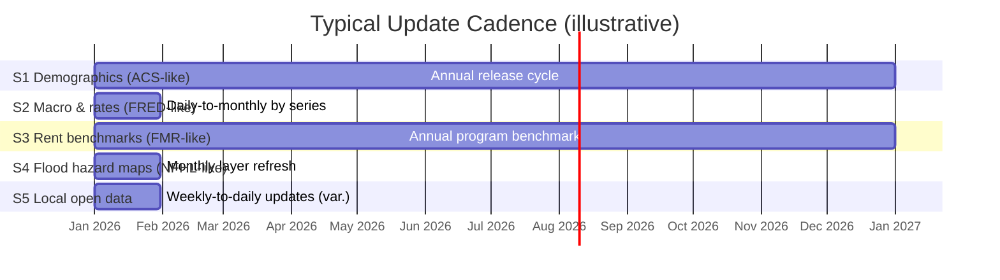

# Open-Source Data and Free API Endpoints for Real Estate Investment Analytics

## Executive summary

Real estate investment analytics typically require three classes of inputs: (a) *market and macro fundamentals* (employment, incomes, inflation, rates), (b) *property and neighborhood fundamentals* (housing stock, tenure, rents, demographics, amenities, transit), and (c) *risk and constraints* (flood hazards, zoning/land-use rules, permits, environmental compliance, and other site constraints). The best “open” ecosystem is strongest in (a) and (c) via official statistics agencies and hazard-mapping authorities, while the weakest area is *property listing inventory and property-level AVMs*, which are usually proprietary or contract-restricted. citeturn49search0turn9search2turn26view1turn39search3

Across the free-and-open landscape, the highest-quality, broadest-coverage, and most reliable sources are U.S. national statistical APIs and official geospatial hazard layers: the entity["organization","U.S. Census Bureau","national statistics agency"] APIs for demographics/housing plus their TIGER-based geospatial services, the entity["organization","Bureau of Labor Statistics","us labor statistics agency"] and entity["organization","Bureau of Economic Analysis","us national accounts agency"] for labor and income/GDP, and the entity["organization","Federal Reserve Bank of St. Louis","central bank research bank"] FRED API for market and policy time series. citeturn39search3turn13search1turn14search0turn24view0turn0search18

For location-specific underwriting and risk screening, the strongest “free API” pattern is to combine: (1) local government parcel/assessment and transaction datasets (often published on Socrata or ArcGIS Hub), (2) national hazard and compliance layers (e.g., FEMA NFHL flood zones; EPA ECHO compliance facilities), and (3) open street and transit data for accessibility proxies. citeturn26view1turn15view0turn40search1turn40search15turn49search6

## Scope, evaluation criteria, and ranking methodology

This report focuses on open data and free API endpoints applicable to real estate investment analytics—covering property transactions, assessor/parcel data, zoning/land use, permits, rents, demographics, economic indicators, mortgage rates, walkability/transit, flood hazards, environmental hazards, and satellite/imagery. Where “open listings” or “free AVMs” are not realistically available at scale, the report documents the closest practical substitutes and highlights licensing limits. citeturn49search0turn9search9turn39search3

### Ranking rubric

Each source is scored along three axes (1–5) and ranked by a weighted composite:

- **Data quality (40%)**: official/statutory source, transparent methodology, stable identifiers, and documented caveats (e.g., margins of error).
- **Geographic coverage (35%)**: national coverage > multi-state > single metro, with credit for consistent boundary definitions.
- **Update frequency/latency (25%)**: high-frequency releases (daily/weekly/monthly) score higher than annual-only releases.

This rubric intentionally elevates primary government/statistical systems and official hazard layers because they are typically the most defensible in investment memos and compliance reviews. citeturn39search7turn14search0turn26view1turn21view0

### Summary of top-ranked sources

On this rubric, the top tier for broad U.S.-centric investment analytics is:

- Census Data API (ACS) + TIGER/Geocoder for consistent small-area demographics and housing stock. citeturn39search3turn13search1turn39search1turn4search15  
- BLS Public Data API for labor market and inflation measures with clear API limits. citeturn14search0turn14search11  
- BEA API for regional personal income and related macro aggregates (with documented throttling guidance in official tooling). citeturn24view0turn14search12  
- FRED API for mortgage-rate series and macro/financial indicators (rate limited; implement backoff). citeturn0search18turn13search6  
- FEMA NFHL official flood hazard polygons (monthly updates) for underwriting hazard overlays. citeturn26view1  
- HUDUSER FMR API for rent proxies/affordability benchmarks with explicit API ToS and call limits. citeturn9search0turn13search17  

## Catalog of open data sources and free APIs

The entries below are prioritized toward official sources first, then widely used open datasets and “free tier” services. URLs and sample endpoints are shown as code to satisfy a “documentation link” requirement.

### Government statistics, demographics, and macro fundamentals

**Census Data API (ACS 5-year and other datasets)** citeturn39search3turn13search1turn39search7  
| Field | Details |
|---|---|
| Name | Census Data API (ACS, Decennial, etc.) |
| Docs | `https://www.census.gov/data/developers/guidance/api-user-guide.html` and dataset pages like `https://www.census.gov/data/developers/data-sets/acs-5year.html` citeturn4search23turn39search3 |
| Coverage | Primarily entity["country","United States","country"] (all states/territories; most ACS geographies). citeturn39search7 |
| Data types / fields | Demographics, income, tenure, commuting, housing characteristics; variable universe depends on table. Variables can change year-to-year. citeturn39search3 |
| Update frequency | ACS 5-year is annual (example: 2020–2024 estimates released on a scheduled December date; related PUMS/variance releases can follow). citeturn39search7 |
| Access method | REST-style GET with `get=`, `for=`, `in=`; JSON/CSV output. Example endpoint pattern: `https://api.census.gov/data/<YEAR>/acs/acs5?...` citeturn4search23turn39search3 |
| Auth | No key for light usage; key recommended/required above threshold. citeturn13search1 |
| Rate limits | Up to 50 variables per query; ~500 queries per IP/day before requiring a registered Census key. citeturn13search1turn13search13 |
| License / terms | U.S. federal statistical data is generally reusable; follow dataset-specific notices and attribution guidance where applicable. citeturn13search1turn39search3 |
| Data quality / limitations | Survey-based estimates include sampling error; small geographies can have high margins of error. Variable definitions and codes can change across annual vintages. citeturn39search3 |
| Cost | Free |
| Investment use-cases | Market selection (income, population growth proxies), tenant demand modeling, rent-to-income stress, demographic-driven absorption, tract/ZIP screening. |

**Census TIGERweb GeoServices REST API (TIGERweb)** citeturn39search1turn39search12  
| Field | Details |
|---|---|
| Name | TIGERweb GeoServices REST API |
| Docs | `https://www.census.gov/data/developers/data-sets/TIGERweb-map-service.html` citeturn39search1 |
| Coverage | U.S. national boundary and feature layers (current and historical services exist). citeturn39search12 |
| Data types / fields | Administrative/statistical boundaries and selected features from the Census geospatial database. citeturn39search1 |
| Update | “Current” services update as TIGER/Line updates roll out (annual TIGER/Line and periodic service updates). citeturn39search0 |
| Access method | GeoServices/ArcGIS REST patterns; can integrate in GIS/web mapping clients. citeturn39search1turn39search16 |
| Auth | Generally open |
| Rate limits | Not consistently stated; design caching and tiling. citeturn39search1 |
| License / terms | Boundaries are for statistical use and not legal land descriptions. citeturn39search11 |
| Data quality / limitations | Geometry precision and “legal boundary” caveats; avoid treating TIGER as survey-grade parcel boundaries. citeturn39search11 |
| Cost | Free |
| Use-cases | Spatial joins (tract/ZIP/county), mapping, consistent geography keys for ACS/BLS/BEA merges. |

**Census Geocoding Services (Census Geocoder)** citeturn4search11turn4search15  
| Field | Details |
|---|---|
| Name | Census Geocoder |
| Docs | `https://www.census.gov/data/developers/data-sets/Geocoding-services.html` and technical documentation `https://www.census.gov/programs-surveys/geography/technical-documentation/complete-technical-documentation/census-geocoder.html` citeturn4search11turn4search15 |
| Coverage | U.S.; geocodes and returns Census geographies based on MAF/TIGER ranges. citeturn4search15 |
| Data types / fields | Address → lat/long; address ranges; geography (tract, block group, etc.) depending on request. citeturn4search15 |
| Update | Underlying MAF/TIGER updates; not “real-time.” citeturn4search15 |
| Access method | Single-address endpoints and batch (up to 10,000 addresses per batch submission described in docs). citeturn4search15 |
| Auth | Generally open |
| Rate limits | Batch size limits are explicit; throughput limits are not consistently published—implement retry/backoff. citeturn4search15 |
| License / terms | U.S. government service; follow usage guidance. citeturn4search15 |
| Data quality / limitations | Range-based geocoding means a valid number can geocode even if a structure does not exist; verify with parcel/building sources when needed. citeturn4search15 |
| Cost | Free |
| Use-cases | Normalizing addresses to tract/ZIP/county for joins; pre-processing a deal pipeline. |

**BLS Public Data API** citeturn14search0turn14search11  
| Field | Details |
|---|---|
| Name | BLS Public Data API (v2 recommended) |
| Docs | `https://www.bls.gov/developers/api_faqs.htm` and features page `https://www.bls.gov/bls/api_features.htm` citeturn14search0turn14search3 |
| Coverage | U.S. national + subnational depending on series (e.g., CPI, unemployment). citeturn14search3 |
| Data types / fields | Time series by series ID: employment, wages, CPI/inflation, etc. citeturn14search3 |
| Update | Varies by program; many key series are monthly. citeturn14search3 |
| Access method | JSON requests for series IDs and date ranges. citeturn14search0 |
| Auth | Registration is required for full v2 features; terms apply. citeturn14search3turn14search11 |
| Rate limits | Request rate limit ~50 requests per 10 seconds; daily query limits differ (registered vs unregistered), with registered up to 500/day per FAQ table. citeturn14search0 |
| License / terms | Subject to BLS API terms including right-to-limit access. citeturn14search11 |
| Data quality / limitations | Requires correct series IDs; returns observations and footnotes; metadata retrieval is limited per docs. citeturn14search3 |
| Cost | Free |
| Use-cases | Market scoring models: job growth, unemployment pressure, wage growth; inflation assumptions in pro formas; scenario analysis. |

**BEA API** citeturn24view0turn14search12  
| Field | Details |
|---|---|
| Name | BEA Web Service API |
| Docs | `https://apps.bea.gov/api/` and user guide PDF `https://apps.bea.gov/api/_pdf/bea_web_service_api_user_guide.pdf` citeturn24view0 |
| Coverage | U.S. national + regional (states, counties, MSAs depending on dataset, e.g., regional income tables). citeturn24view0 |
| Data types / fields | National accounts and regional income/product series (dataset-specific). citeturn24view0 |
| Update | Varies; many macro series update quarterly/annually. citeturn24view0 |
| Access method | Query-string parameters including `UserID`, `method`, `DataSetName`, `ResultFormat`. Example requests are shown in the user guide. citeturn24view0 |
| Auth | API key (`UserID`) required. citeturn24view0 |
| Rate limits | Official tooling documents throttling at 100 requests/minute and 100MB/minute (plus error throttles), with temporary blocks for exceedance. citeturn14search12 |
| License / terms | Public statistics; follow BEA terms and citation guidance. citeturn24view0 |
| Data quality / limitations | Table/parameter discovery steps required (GetParameterValues methods). citeturn24view0 |
| Cost | Free |
| Use-cases | Regional income momentum, GDP-like measures, macro and regional drivers for rent growth assumptions. |

**FRED API** citeturn0search18turn13search6  
| Field | Details |
|---|---|
| Name | FRED API (St. Louis Fed Web Services) |
| Docs | `https://fred.stlouisfed.org/docs/api/fred/` citeturn0search18 |
| Coverage | Global-ish catalog (many U.S. series; international series included depending on provider). citeturn0search18 |
| Data types / fields | Time series observations; strong coverage for rates and macro indicators used in underwriting. citeturn0search18 |
| Update | By series—some daily, weekly, monthly. citeturn0search18 |
| Access method | REST endpoints like `/fred/series/observations` with `series_id`, `api_key`, `file_type=json`. citeturn0search18 |
| Auth | API key required (error if missing). citeturn13search6 |
| Rate limits | API is rate limited but the official error documentation does not publish a numeric quota; design exponential backoff. Some client tooling assumes ~120 requests/minute as a practical limit (treat as empirical, not contractual). citeturn13search6turn13search3 |
| License / terms | Follow FRED API terms; series may have provider-specific reuse rules. citeturn0search18 |
| Use-cases | Discount rate inputs, mortgage-rate tracking, cap rate regime proxies, scenario stress testing. |

**Mortgage rate benchmarks: Freddie Mac PMMS (download)** citeturn1search3  
| Field | Details |
|---|---|
| Name | PMMS: Primary Mortgage Market Survey |
| Docs | `https://www.freddiemac.com/pmms` citeturn1search3 |
| Coverage | U.S. benchmark rates (survey). citeturn1search3 |
| Data | Weekly mortgage rate series (benchmark). citeturn1search3 |
| Update | Weekly. citeturn1search3 |
| Access | Primarily download/website (not a public REST API as documented on that page). citeturn1search3 |
| Use-cases | Underwriting interest-rate assumptions; complement to FRED series (e.g., `MORTGAGE30US`). citeturn0search18turn1search3 |

**House price index benchmark: FHFA HPI (download)** citeturn1search2  
| Field | Details |
|---|---|
| Name | FHFA House Price Index |
| Docs | `https://www.fhfa.gov/DataTools/Downloads/Pages/House-Price-Index-Datasets.aspx` citeturn1search2 |
| Coverage | U.S. national and regional index series (dataset provides multiple geographies/products). citeturn1search2 |
| Update | Periodic (often quarterly/monthly depending on product). citeturn1search2 |
| Access | Download datasets (CSV/Excel), not primarily a free query API. citeturn1search2 |
| Use-cases | Market price trend modeling, stress scenarios, portfolio performance benchmarking. citeturn1search2 |

### Housing rents, affordability, and related HUD APIs

**HUDUSER Fair Market Rents (FMR) API** citeturn9search0turn13search17  
| Field | Details |
|---|---|
| Name | HUDUSER FMR API |
| Docs | `https://www.huduser.gov/portal/dataset/fmr-api.html` and HUDUSER API Terms `https://www.huduser.gov/portal/dataset/api-terms-of-service.html` citeturn9search0turn13search17 |
| Coverage | U.S. states/counties/metro areas (FMR geographies). citeturn9search0turn9search3 |
| Data types / fields | FMR values (by bedroom size) and lookup endpoints (states/counties). citeturn9search0 |
| Update | Typically annual (FMR schedule), with versioning by updated year parameters in the API. citeturn9search0turn9search3 |
| Access method | Base URL: `https://www.huduser.gov/hudapi/public/fmr` with endpoints such as `fmr/listStates`, `fmr/listCounties/{stateid}`. citeturn9search0 |
| Auth | Requires HUDUser account and a bearer token in `Authorization: Bearer <token>`. citeturn13search2 |
| Rate limits | HUDUser ToS states a maximum of 60 queries per minute. citeturn13search17 |
| License / terms | Governed by HUDUser API ToS; monitor usage and comply with restrictions. citeturn13search17 |
| Data quality / limitations | FMR is a program benchmark (not a listing feed); use as rent proxy and affordability reference, not as an asking-rent micro dataset. citeturn9search3 |
| Cost | Free with account/token |
| Use-cases | “Rent plausibility” checks, voucher-market risk, affordability screens, rent stress vs income metrics. |

### Local property records: transactions, assessor, parcels, permits

A recurring reality: **property-level transactions and assessor data are usually local**, not national, in the U.S. The best practice is to standardize an ingestion layer that can pull from the common open-data platforms used by cities and counties (Socrata, ArcGIS Hub/Feature Services), then normalize into a parcel/building master table. citeturn40search1turn40search15turn40search20

**NYC PLUTO (parcel/land-use/tax lot)** citeturn5search17turn5search1  
| Field | Details |
|---|---|
| Name | Primary Land Use Tax Lot Output (PLUTO) |
| Docs | Dataset: `https://data.cityofnewyork.us/.../64uk-42ks` (Socrata) and catalog entry with version metadata. citeturn5search1turn5search17 |
| Coverage | entity["city","New York City","new york, us"] tax lots. citeturn5search1 |
| Data types / fields | Lot-level land use and geography; “70+ fields” and multiple agency-derived attributes per catalog description. citeturn5search17 |
| Update | Versioned releases (catalog notes current version and metadata update). citeturn5search17 |
| Access method | Socrata Open Data API (SODA)/OData endpoints provided via dataset page. citeturn5search1turn40search11 |
| Auth | Many Socrata datasets are open; app tokens increase throttle limits. citeturn40search1 |
| Rate limits | Platform-dependent throttling; use app token + paging (`$limit`, `$offset`). citeturn40search1turn40search15 |
| License / terms | City open data terms apply; verify dataset-specific license in portal metadata. citeturn5search1 |
| Limitations | City-specific schema; join keys and field definitions change across versions; validate before trend comparisons. citeturn5search17 |
| Use-cases | Parcel master table (BBL), land-use/zoning proxies, tax assessment features, redevelopment screening. |

**NYC ACRIS (recorded property documents / transactions)** citeturn8search0turn8search4  
| Field | Details |
|---|---|
| Name | ACRIS (Automated City Register Information System) + NYC Open Data extracts |
| Docs | ACRIS overview: `https://www.nyc.gov/site/finance/property/acris.page`; example Open Data datasets: `https://data.cityofnewyork.us/.../8h5j-fqxa` (Real Property Legals), `.../bnx9-e6tj` (Master). citeturn8search0turn8search4turn8search8 |
| Coverage | NYC boroughs listed by ACRIS page (Manhattan, Queens, Bronx, Brooklyn) with records from 1966 to present. citeturn8search0 |
| Data types | Deeds, recorded documents, related legal/party records; separate tables in Open Data extracts. citeturn8search0turn8search4 |
| Update | Open Data extracts show “Last Updated” timestamps (example shown in Feb 2026). citeturn8search4turn8search8 |
| Access | NYC Open Data (Socrata/OData) endpoints for structured extracts; document images via ACRIS UI. citeturn8search0turn8search4 |
| Use-cases | Sales comps, lien/mortgage research (where represented), time-to-record analytics, title-adjacent screening. |

**Cook County (Assessor Parcel Sales)** citeturn8search9turn8search1  
| Field | Details |
|---|---|
| Name | Assessor – Parcel Sales |
| Docs | Dataset portal entry: `https://datacatalog.cookcountyil.gov/.../wvhk-k5uv` and data.gov catalog text describing coverage and usage. citeturn8search1turn8search9 |
| Coverage | entity["place","Cook County","illinois, us"] parcels; “1999 to present” per catalog entry. citeturn8search9 |
| Data types | Parcel sales records used for modeling fair market value; includes parcel identifiers (PIN) and sale document references. citeturn8search9 |
| Update | Dataset portal notes recent changes and ongoing maintenance (see dataset page notes). citeturn8search1 |
| Access | County open data portal (Socrata-style API). citeturn8search1turn40search11 |
| Use-cases | Repeat-sales analysis, comps modeling, hedonic baselines, training data for custom AVMs. |

**City building permit datasets (examples)**  
- entity["city","Chicago","illinois, us"] Building Permits (Socrata) citeturn8search11turn8search7  
- entity["city","Los Angeles","california, us"] LADBS Permits (Socrata) citeturn8search2turn8search6  

These are essential for “capex shock” and neighborhood transition signals (renovations, new units, ADUs, major alterations) and can be used in hazard-adjusted growth screens. citeturn8search11turn8search2

**U.S. Census Building Permits Survey (BPS) (download; schedule guidance)** citeturn5search0  
| Field | Details |
|---|---|
| Name | Building Permits Survey (BPS) |
| Docs | `https://www.census.gov/permits` citeturn5search0 |
| Coverage | U.S.; national/region/state/CBSA-level in provided downloads. citeturn5search0 |
| Update | Revised permits “usually released on the 17th workday of the month” (schedule caveats noted on page). citeturn5search0 |
| Access | Website downloads; for time-series API access, use Census EITS endpoints. citeturn5search8turn25view0 |
| Use-cases | Construction-cycle timing, supply pipeline signals, cap rate regime overlays by metro. |

**Census Economic Indicators Time Series (EITS) API (construction/housing indicators)** citeturn25view0turn5search8  
| Field | Details |
|---|---|
| Name | Census EITS API |
| Docs | EITS landing: `https://api.census.gov/data/timeseries/eits.html`; user guide PDF. citeturn5search8turn25view0 |
| Coverage | U.S. |
| Data | Monthly/quarterly economic indicators (includes housing/construction series such as New Residential Construction per user guide). citeturn22view1turn23view2 |
| Rate limits | User guide states 500 calls/day without a key; more requires an API key. citeturn25view0 |
| Use-cases | Supply and construction momentum features; macro overlay for rent growth and absorption models. |

**UK Land Registry Price Paid Data (transactions)** citeturn7search1turn7search17  
| Field | Details |
|---|---|
| Name | Price Paid Data (PPD) |
| Docs | `https://www.gov.uk/government/statistical-data-sets/price-paid-data-downloads` citeturn7search1 |
| Coverage | entity["country","United Kingdom","country"] (dataset scope as defined by Land Registry; timing and fields in download). citeturn7search1 |
| Data | Residential transactions with price paid (download in CSV/text; linked-data access available per page). citeturn7search1 |
| Update | Page shows a “last updated” date and is updated frequently (example: late Jan 2026). citeturn7search1 |
| Access | Bulk downloads + linked data tooling; treat as primary transaction dataset for UK analyses. citeturn7search1turn7search17 |
| Use-cases | UK comps, repeat-sales indices, spatial price gradients, pipeline backtesting. |

**UK ONS Statistics API (demographics/macro)** citeturn7search3turn7search15  
| Field | Details |
|---|---|
| Name | ONS API |
| Docs | `https://developer.ons.gov.uk/` with base `https://api.beta.ons.gov.uk/v1` citeturn7search3 |
| Coverage | UK |
| Auth | Open and unrestricted; no API keys required (Beta; breaking changes possible). citeturn7search3turn7search7 |
| Use-cases | UK demand fundamentals, income trends, demographic movements. |

### Zoning and land use

**National Zoning and Land Use Database (NZLUD) (open code + data)** citeturn10view0turn11view0turn12search4  
| Field | Details |
|---|---|
| Name | National Zoning and Land Use Database (NZLUD) |
| Docs | Project page + public GitHub repository (`mtmleczko/nzlud`) with an MIT license. citeturn10view0turn11view0 |
| Coverage | U.S.; project page states “over 2,600 municipalities.” citeturn10view0 |
| Data | Structured zoning code elements; paper describes NLP construction approach. citeturn12search4 |
| Update | Project describes itself as evolving; last updated date posted on project page. citeturn10view0 |
| Access | Download datasets from repository (not a centralized REST API). citeturn11view0 |
| License | Code/data repo under MIT (verify any embedded source data in subfolders). citeturn11view0 |
| Use-cases | Supply constraints and entitlement risk scoring; “zoning friction” variables in market selection models. |

**Important note on “zoning APIs”**: In the U.S., parcel-level zoning maps and text are overwhelmingly local and not standardized. Practical integration uses city/county open-data GIS layers (often ArcGIS feature services) plus third-party standardization efforts (where licensing permits). citeturn40search20turn10view0

### Flood, FEMA floodplain products, and hazard screening

**FEMA National Flood Hazard Layer (NFHL) (ArcGIS FeatureServer)** citeturn26view1  
| Field | Details |
|---|---|
| Name | NFHL (FIRM polygons) |
| Docs | Feature service directory for `FEMA_National_Flood_Hazard_Layer (FeatureServer)` citeturn26view1 |
| Coverage | U.S.; described as incorporating all published FIRM databases and LOMRs; provided as state/territory datasets. citeturn26view1 |
| Data | Flood hazard polygons (SFHA and related zones); spatial reference and service caps (e.g., max record count). citeturn26view1 |
| Update | Monthly. citeturn26view1 |
| Access | ArcGIS REST `query` operation and related layer endpoints. citeturn26view1turn40search20 |
| Auth | Typically open |
| Rate limits | Service shows `Max Record Count: 2000`; paginate/geometry-tile queries accordingly. citeturn26view1turn40search20 |
| Use-cases | Flood-zone overlay, insurance and underwriting flags, portfolio coastal risk screens, scenario overlays with sea-level/precip trends. |

image_group{"layout":"carousel","aspect_ratio":"16:9","query":["FEMA National Flood Hazard Layer map example","ArcGIS FeatureServer query example map","EPA ECHO facility map example","OpenStreetMap walkability amenities map"],"num_per_query":1}

**OpenFEMA API (disaster declarations, NFIP-related datasets; access considerations)** citeturn38view0turn38view2  
| Field | Details |
|---|---|
| Name | OpenFEMA API |
| Docs | FEMA docs are not consistently accessible via automated retrieval in this environment; however, public client documentation and a Microsoft connector describe endpoints, parameters, and throttling. See: `https://docs.ropensci.org/rfema/` and `https://learn.microsoft.com/en-us/connectors/fema/`. citeturn38view0turn38view2 |
| Coverage | U.S.; OpenFEMA datasets include disasters and some NFIP-related datasets (dataset-dependent). citeturn38view0turn38view2 |
| Data | Disaster declarations summaries and other FEMA datasets; API supports OData-style parameters (`$filter`, `$top`, `$skip`, `$select`, etc.). citeturn38view2turn38view0 |
| Update | Dataset-dependent; OpenFEMA “datasets” metadata includes update frequency fields per connector docs. citeturn38view2 |
| Auth | Public access (no API key) is stated in rfema documentation; validate against current FEMA terms in production. citeturn38view0 |
| Rate limits | Example throttling shown in connector: 100 calls per 60 seconds per connection. citeturn38view2 |
| Use-cases | FEMA disaster exposure proxies, historical disaster frequency features for market risk scoring, (where allowed) NFIP-related claim/coverage analytics. |

### Environmental hazards and compliance adjacency

**EPA ECHO Web Services (facility searches and compliance)** citeturn15view0turn21view0turn21view1  
| Field | Details |
|---|---|
| Name | ECHO Web Services (search and detailed reports) |
| Docs | Web services landing `https://echo.epa.gov/tools/web-services` and supporting REST PDFs: “ECHO DFR REST Services” and “ECHO All Data Search Results Services.” citeturn15view0turn21view0turn21view1 |
| Coverage | U.S. regulated facilities across Clean Air Act, Clean Water Act/NPDES, RCRA, SDWA, and enforcement cases depending on service. citeturn15view0turn21view0 |
| Data types | Facility search results; detailed facility report components; enforcement/compliance summaries; map outputs. citeturn15view0turn21view0turn21view1 |
| Update | Live feed as described by ECHO web services. citeturn15view0 |
| Access method | Query-only REST-like services returning XML/JSON/JSONP; base URLs shown in PDFs (e.g., DFR base and get_qid base). citeturn21view0turn21view1 |
| Auth | Public per service docs (no key described in the cited PDFs). citeturn21view0turn21view1 |
| Rate limits | Not clearly published in the cited docs; implement caching and avoid high-frequency polling. citeturn15view0 |
| Data quality / limitations | Best for adjacency screening (nearby regulated facilities, enforcement history proxies), not a definitive site contamination record. Validate with state/local environmental agencies and due diligence. citeturn15view0turn21view0 |
| Use-cases | Environmental risk adjacency overlays; ESG screening; industrial neighborhood risk flags. |

### Walkability, transit accessibility, and street-level features

**Walk Score API** citeturn49search0turn49search17  
| Field | Details |
|---|---|
| Name | Walk Score API (Score API + transit/bike) |
| Docs | `https://www.walkscore.com/professional/api.php` and Developer Center pages. citeturn49search0turn49search5 |
| Coverage | entity["country","Canada","country"] and U.S. only, per Walk Score docs. citeturn49search0 |
| Data | Walk Score / Transit Score / Bike Score for locations; also transit-related endpoints. citeturn49search0turn49search20 |
| Update | Not published as a schedule; treat as periodically updated scoring. citeturn49search0 |
| Access | HTTP GET with API key; “live API call” examples shown in docs. citeturn49search0 |
| Auth | API key required. citeturn49search0 |
| Rate limits | Example quota shown after key issuance: 5,000 calls/day. citeturn49search17 |
| License / terms | Branding requirements and terms apply; caching rules vary by plan. citeturn49search11turn49search3 |
| Use-cases | Amenity/accessibility feature for rent premium models; screeners for transit-oriented assets; comp set normalization. |

**Transitland v2 REST API (GTFS archive, global transit)** citeturn49search1turn49search6  
| Field | Details |
|---|---|
| Name | Transitland v2 REST API |
| Docs | `https://www.transit.land/documentation/rest-api/` |
| Coverage | Global where GTFS feeds exist in Transitland’s archive. citeturn49search1 |
| Data | Feeds, operators, routes/stops (endpoint-dependent). citeturn49search10 |
| Access | Base URL: `https://transit.land/api/v2/rest` with API key in header or query parameter. citeturn49search1 |
| Auth | API key required. citeturn49search1turn49search2 |
| Free tier limits | Free plan lists REST API: 10,000 queries/month; vector tiles and routing have separate monthly quotas. citeturn49search6 |
| License / terms | Must follow Transitland terms and attribution. citeturn49search6 |
| Use-cases | Measuring transit accessibility (stop density, headways where supported), TOD screening, travel-time proxies (where available). |

**OpenStreetMap Overpass API + ODbL** citeturn3search0turn3search1  
| Field | Details |
|---|---|
| Name | OpenStreetMap (Overpass query endpoint) |
| Docs | Overpass API wiki and OSM license page. citeturn3search0turn3search1 |
| Coverage | Global |
| Data | POIs/amenities, roads, landuse tags, many community-maintained features. citeturn3search0 |
| Update | Near-real-time edits; extraction cadence depends on your pipeline. citeturn3search0 |
| Access | Overpass QL queries via public endpoints; heavy use should be self-hosted or rate-limited. citeturn3search0 |
| License | ODbL 1.0 with attribution and share-alike obligations for “Produced Works”/derivatives as defined by ODbL. citeturn3search1 |
| Use-cases | Feature engineering: amenity density, distance-to-transit, retail clustering, neighborhood scoring models. |

### Satellite/imagery, building footprints, and geospatial primitives

**Copernicus Data Space Ecosystem APIs (Sentinel Hub + OData)** citeturn6search2turn6search6turn6search5  
| Field | Details |
|---|---|
| Name | Copernicus Data Space Ecosystem APIs |
| Docs | API portal and OData catalogue: `https://dataspace.copernicus.eu/analyse/apis` and `https://dataspace.copernicus.eu/analyse/apis/catalogue-apis`; quota and rate limiting docs. citeturn6search2turn6search6turn6search5 |
| Coverage | Global EO archives (Sentinel and related archives depending on API). citeturn6search2 |
| Data | Satellite imagery, derived products, metadata search. citeturn6search6turn6search10 |
| Update | Depends on satellite mission; APIs provide ongoing archive access. citeturn6search2 |
| Auth | Account-based quotas/limits; rate limiting varies by plan. citeturn6search1turn6search5 |
| Quotas | Documentation describes monthly quotas and request limits that reset monthly. citeturn6search5 |
| Use-cases | Roof/land cover proxies, construction change detection, neighborhood greenness/heat proxies, flood aftermath screening (careful: do not over-claim). |

**USGS Machine-to-Machine (M2M) API (EROS; imagery downloads)** citeturn48view0turn48view1turn42search13  
| Field | Details |
|---|---|
| Name | USGS M2M API (EROS) |
| Docs | M2M application token documentation and USGS notice about login-token usage. citeturn48view0turn48view1turn42search13 |
| Coverage | Global archive depending on dataset; used for USGS/EROS datasets (e.g., Landsat). citeturn48view1 |
| Access | REST JSON endpoints under `https://m2m.cr.usgs.gov/api/api/json/stable/` using `login-token`. citeturn48view1turn42search13 |
| Auth | Requires ERS registration; application tokens and `X-Auth-Token` for requests described in docs. citeturn48view0turn48view1 |
| Update | Dataset-dependent. citeturn48view1 |
| Use-cases | Historical imagery for neighborhood change, sprawl and infill identification, large-area remote sensing features in models. |

**OpenAddresses (address points; global)** citeturn4search12  
| Field | Details |
|---|---|
| Name | OpenAddresses |
| Docs | `https://openaddresses.io/` (project page) citeturn4search12 |
| Coverage | Global (varies by contributing jurisdiction). citeturn4search12 |
| Data | Address points/rows; individual datasets may have their own licenses. citeturn4search12 |
| License | Project states collection is released under CC0; underlying sources may vary. citeturn4search12 |
| Use-cases | Address normalization, geocoding seeds, matching assessor/permit datasets. |

**Microsoft Building Footprints (example: ArcGIS item; ODbL)** citeturn4search21  
| Field | Details |
|---|---|
| Name | Microsoft Building Footprints (dataset family) |
| Docs | Example ArcGIS item specifies ODbL license. citeturn4search21 |
| Coverage | Varies by release; often large regional footprint sets. citeturn4search21 |
| License | ODbL per item description. citeturn4search21 |
| Use-cases | Building density proxies, footprint-area features, redevelopment signals when compared across vintages (if available). |

**Google Open Buildings (building footprints; dual-licensed datasets)** citeturn6search4turn6search20  
| Field | Details |
|---|---|
| Name | Google Open Buildings (various releases) |
| Docs | Open Buildings project pages + Earth Engine catalog entries; dual license rationale is documented. citeturn6search4turn6search0turn6search20 |
| Coverage | Focus on Africa and parts of Latin America/Asia per dataset descriptions. citeturn6search20 |
| License | Released under CC BY 4.0 and ODbL v1.0 (user may choose). citeturn6search4turn6search0 |
| Use-cases | Emerging-market built environment proxies, density screening, input features for rent/absorption models where traditional data is limited. |

### Open-data platforms that matter in practice (for parcels, permits, zoning layers, transactions)

These are not a single “dataset,” but they are the most common *ways you will actually access local real estate data at scale*.

**Socrata Open Data API (SODA)** citeturn40search11turn40search15turn40search1  
| Field | Details |
|---|---|
| Name | SODA (Socrata Open Data API) |
| Docs | `https://dev.socrata.com/docs/endpoints.html` and paging/app-token pages. citeturn40search11turn40search15turn40search1 |
| Coverage | Depends on the publisher portal (cities/counties/states). citeturn40search11 |
| Access | SoQL queries with `$select`, `$where`, `$limit`, `$offset`, and OData variants in some portals. citeturn40search15 |
| Rate limits | App tokens allow throttling by application (higher limits than IP-only). Paging returns up to 50,000 records/page per guidance. citeturn40search1turn40search15 |
| Use-cases | Standard connector for permits, transactions, assessor extracts (e.g., NYC, Chicago, Cook County). citeturn5search1turn8search7turn8search1 |

**ArcGIS REST Feature Services (common for FEMA, state portals, county parcel GIS)** citeturn40search2turn40search20turn26view1  
| Field | Details |
|---|---|
| Name | ArcGIS Feature Service `query` operation |
| Docs | Esri REST query reference and feature layer limits. citeturn40search2turn40search20 |
| Key limitation | `maxRecordCount` commonly defaults to 2000 (and is service-configured); you must paginate or tile. citeturn40search20turn26view1 |
| Use-cases | Flood polygons (NFHL), statewide parcel layers (where available), zoning maps, permit points, environmental layers. citeturn26view1turn9search7 |

**Data.gov catalog CKAN API + api.data.gov keying** citeturn40search10turn13search10  
| Field | Details |
|---|---|
| Name | Data.gov CKAN API + api.data.gov key |
| Docs | Data.gov user guide: base `https://catalog.data.gov/api/3/` and api.data.gov developer manual (demo key limits). citeturn40search10turn13search10 |
| Coverage | U.S. government dataset catalog (metadata + links). citeturn40search10 |
| Use-cases | Discovering parcel, assessor, permit, hazard, and demographic datasets by tags (e.g., “parcels,” “permits”). citeturn5search3turn40search10 |

### “Listings” and AVMs: what is and isn’t realistically open

- **Property listings (for-sale inventory)**: In the U.S., MLS and portal listing feeds are typically proprietary and contract-restricted. Free/open equivalents are rare; do *not* build investment pipelines that scrape listing sites unless you have explicit permission and ToS allow it.  
- **AVMs**: “Free AVM APIs” at property level are usually commercial and restricted; the closest open substitute is to build *your own* valuation features from (i) assessor values, (ii) recorded sales outputs, (iii) housing attributes, (iv) neighborhood and hazard features, and (v) macro/time series. This approach is consistent with how the NZLUD paper demonstrates structured extraction to create modeling-ready variables from public administrative text. citeturn12search4turn8search9turn5search17  
- **Free-but-not-open rental indices**: For example, Zillow publishes rental indices and methodology, but use is governed by their terms. Treat such datasets as “free access with legal constraints,” not open data. citeturn9search2turn9search5turn9search9  

## Top-ranked sources and integration examples

This section provides integration guidance and concrete query examples for five of the strongest, broadly useful free APIs. The examples emphasize stable identifiers (FIPS/tract/ZIP), caching, and joining strategies.

### Integration architecture flowchart



### Data update frequency timeline chart

Legend: S1 (Demographics), S2 (Macro time series), S3 (Rent benchmarks), S4 (Flood hazard), S5 (Local permits/transactions).



### Example queries and code for five top APIs

#### Census ACS 5-year (demographics/housing)

Key constraints: query limits (variables per call and daily IP quota) require batching and caching. citeturn13search1turn39search3

cURL example (ZIP Code Tabulation Area; replace year/geography as needed):
```bash
curl "https://api.census.gov/data/2024/acs/acs5?get=NAME,B01001_001E,B19013_001E&for=zip%20code%20tabulation%20area:10001"
```

Python `requests` example:
```python
import requests

url = "https://api.census.gov/data/2024/acs/acs5"
params = {
    "get": "NAME,B01001_001E,B19013_001E",  # total population, median household income
    "for": "zip code tabulation area:10001",
    # "key": "YOUR_CENSUS_API_KEY"  # add if you exceed unauthenticated quota
}
r = requests.get(url, params=params, timeout=30)
r.raise_for_status()
data = r.json()
header, row = data[0], data[1]
print(dict(zip(header, row)))
```

#### FRED (mortgage rates and macro series)

FRED endpoints require an API key; errors documentation notes rate limiting—implement backoff and cache series locally. citeturn13search6turn0search18

cURL example (30-year fixed mortgage rate series):
```bash
curl "https://api.stlouisfed.org/fred/series/observations?series_id=MORTGAGE30US&api_key=YOUR_FRED_KEY&file_type=json"
```

Python `requests` example:
```python
import requests

url = "https://api.stlouisfed.org/fred/series/observations"
params = {
    "series_id": "MORTGAGE30US",
    "api_key": "YOUR_FRED_KEY",
    "file_type": "json",
}
r = requests.get(url, params=params, timeout=30)
r.raise_for_status()
obs = r.json()["observations"]
print(obs[-3:])  # last 3 observations
```

#### BLS Public Data API (jobs/inflation)

BLS documents daily query limits and request-rate limits; design batching and store a local mirror for repeated investment screens. citeturn14search0turn14search3

cURL example (v2 endpoint; series IDs are required):
```bash
curl -X POST "https://api.bls.gov/publicAPI/v2/timeseries/data/" \
  -H "Content-Type: application/json" \
  -d '{
    "seriesid": ["LAUCN360610000000003"],
    "startyear": "2023",
    "endyear": "2025",
    "registrationkey": "YOUR_BLS_KEY"
  }'
```

Python `requests` example:
```python
import requests

url = "https://api.bls.gov/publicAPI/v2/timeseries/data/"
payload = {
    "seriesid": ["LAUCN360610000000003"],  # example series
    "startyear": "2023",
    "endyear": "2025",
    "registrationkey": "YOUR_BLS_KEY",
}
r = requests.post(url, json=payload, timeout=30)
r.raise_for_status()
print(r.json()["Results"]["series"][0]["data"][:3])
```

#### HUDUSER FMR API (rent benchmarks)

HUDUSER requires a bearer token and states a 60 queries/min limit in its ToS—treat this as a hard guardrail in production. citeturn13search2turn13search17turn9search0

cURL example:
```bash
curl "https://www.huduser.gov/hudapi/public/fmr/listStates" \
  -H "Authorization: Bearer YOUR_HUDUSER_TOKEN"
```

Python `requests` example:
```python
import requests

url = "https://www.huduser.gov/hudapi/public/fmr/listStates"
headers = {"Authorization": "Bearer YOUR_HUDUSER_TOKEN"}
r = requests.get(url, headers=headers, timeout=30)
r.raise_for_status()
print(r.json())
```

#### FEMA NFHL flood hazard polygons (ArcGIS FeatureServer)

NFHL is updated monthly and served through an ArcGIS FeatureServer; the service advertises a max record count, so spatial tiling/pagination is mandatory for large areas. citeturn26view1turn40search20

cURL example (illustrative; you must choose actual layer fields and a geometry or bounding box relevant to your target):
```bash
curl "https://services.arcgis.com/2gdL2gxYNFY2TOUb/arcgis/rest/services/FEMA_National_Flood_Hazard_Layer/FeatureServer/0/query?where=1%3D1&outFields=*&resultRecordCount=10&f=pjson"
```

Python `requests` example:
```python
import requests

base = "https://services.arcgis.com/2gdL2gxYNFY2TOUb/arcgis/rest/services/FEMA_National_Flood_Hazard_Layer/FeatureServer/0/query"
params = {
    "where": "1=1",
    "outFields": "*",
    "resultRecordCount": 10,
    "f": "pjson",
}
r = requests.get(base, params=params, timeout=60)
r.raise_for_status()
data = r.json()
print("features_returned:", len(data.get("features", [])))
```

## Comparison table of key sources

The table below compares 18 widely used sources/platforms. (Many more local datasets exist; the “platform” rows explain how to scale discovery and ingestion.) citeturn13search1turn14search0turn25view0turn26view1turn13search17turn49search6turn40search1turn40search20

| Source / API | Primary category | Coverage | Access | Auth | Free-tier / rate limits (as documented) | Typical update cadence | License / terms highlights |
|---|---|---|---|---|---|---|---|
| Census Data API (ACS) | Demographics/housing | U.S. | REST | Optional key (needed above quota) | 50 vars/query; 500 queries/IP/day then key citeturn13search1 | Annual (ACS 5-year) citeturn39search7 | Survey estimates; variable changes citeturn39search3 |
| Census TIGERweb | Boundaries/geography | U.S. | GeoServices REST | Open | Not consistently stated | Annual-ish (TIGER/Line-driven) citeturn39search0 | Not legal land descriptions citeturn39search11 |
| Census Geocoder | Geocoding/crosswalks | U.S. | REST + batch | Open | Batch up to 10,000 addresses citeturn4search15 | TIGER-based updates | Range-based geocoding caveats citeturn4search15 |
| BLS Public Data API | Labor/inflation | U.S. | REST/JSON | Key/registration (v2) | 50 req / 10 sec; daily limits (v2 vs v1) citeturn14search0 | Often monthly | BLS right-to-limit citeturn14search11 |
| BEA API | Income/GDP | U.S. | REST | API key | 100 req/min + 100MB/min (throttling) citeturn14search12 | Quarterly/annual varies | Public statistics |
| FRED API | Rates/macro | Global catalog | REST | API key | Rate limited (numeric not in official docs) citeturn13search6 | Daily–monthly varies | Provider-specific series |
| Freddie Mac PMMS | Mortgage rates | U.S. | Download | None | N/A | Weekly citeturn1search3 | Use as benchmark |
| FHFA HPI | Prices/index | U.S. | Download | None | N/A | Periodic citeturn1search2 | Index, not parcel AVM |
| HUDUSER FMR API | Rent benchmarks | U.S. | REST | Bearer token | 60 queries/min (ToS) citeturn13search17 | Annual-ish citeturn9search3 | HUDUSER ToS applies citeturn13search17 |
| Census EITS API | Housing/construction | U.S. | REST | Key above quota | 500 calls/day without key (guide) citeturn25view0 | Monthly/quarterly varies | Public indicators |
| FEMA NFHL FeatureServer | Flood/floodplain | U.S. | ArcGIS REST | Open | maxRecordCount 2000 (service) citeturn26view1 | Monthly citeturn26view1 | Underwriting hazard overlay |
| OpenFEMA API | Disasters/NFIP-related | U.S. | REST (OData params) | Public (per rfema) | 100 calls/60 sec (connector) citeturn38view2 | Dataset-dependent | Validate FEMA terms in production citeturn38view0 |
| EPA ECHO Web Services | Environmental hazards | U.S. | REST-like | Open | Not clear; use downloads for bulk citeturn15view0 | Live feed citeturn15view0 | Compliance screening; validate locally |
| OpenStreetMap + Overpass | Walkability features | Global | Overpass QL | Open | Public endpoint fair-use | Near real-time edits | ODbL attribution/share-alike citeturn3search1 |
| Walk Score API | Walk/transit score | U.S./Canada | REST | API key | 5,000 calls/day (shown) citeturn49search17 | Not stated | Branding/terms apply citeturn49search3 |
| Transitland v2 | Transit GTFS | Global | REST | API key | Free: 10,000 queries/month citeturn49search6 | Feed-dependent | Attribution/terms citeturn49search6 |
| Socrata SODA | Local open data platform | Publisher-dependent | SoQL/OData | Optional app token | Paging up to 50k/pg; token raises throttle citeturn40search15turn40search1 | Publisher-dependent | Portal terms/dataset licenses |
| ArcGIS Feature Services | Local GIS platform | Publisher-dependent | REST query | Often open | maxRecordCount often 2000–10000 citeturn40search20 | Publisher-dependent | Service terms vary |
| NYC PLUTO | Parcels/assessor-like | NYC | Socrata | Open | SODA paging/token | Versioned releases citeturn5search17 | City open data terms |
| Cook County Parcel Sales | Transactions | Cook County | Socrata | Open | SODA paging/token | Ongoing updates noted citeturn8search1 | County open data terms |

## Legal, licensing, and compliance best practices

### Key licensing and ToS risks

Open-data use in real estate commonly fails at two “edges”:

1. **Crowdsourced/open databases with share-alike terms**: OpenStreetMap data is under ODbL, which carries specific attribution and share-alike requirements depending on how you redistribute derivatives or produced works. If you embed OSM-derived layers into a product, you must design a compliance posture (attribution, possible share-alike triggers, and clear separation of proprietary layers). citeturn3search1  
2. **“Free access” ≠ “open license”**: Some popular real estate indices and portals offer free downloads but impose contractual restrictions (including caching, redistribution, or use in commercial products). A representative example is that Zillow provides developer “Terms of Use” for data and APIs, indicating that usage is governed by contract. citeturn9search9turn9search2  

### Compliance practices that withstand diligence

- **Track provenance and license at the dataset level**: Store license/terms metadata alongside each ingested dataset version and record the extraction timestamp and endpoint parameters used. This is especially important for OpenAddresses, which is CC0 at the collection level but notes that individual sources can carry their own licenses. citeturn4search12  
- **Rate-limit and cache by contract**: Where explicit query caps exist (e.g., HUDUSER’s maximum queries/minute; Census daily quotas; BLS request rate limits), enforce them centrally in an API gateway or ingestion service—not ad hoc in notebooks. citeturn13search17turn13search1turn14search0  
- **Do not treat statistical boundaries as legal boundaries**: TIGER/Line and related boundary products explicitly warn that their boundaries are for statistical purposes and not legal land descriptions. For legal boundary questions (easements, lot lines), you need authoritative cadastral records (often county recorder/assessor). citeturn39search11  
- **Design for service caps (ArcGIS max record count)**: NFHL and many ArcGIS services expose `maxRecordCount` (commonly 2000) so your extraction must implement pagination or spatial tiling. citeturn26view1turn40search20  
- **Avoid prohibited scraping**: If you need listing-level data, obtain it via licensed feeds, partnerships, or user-permissioned exports. “Scrape-to-compete” strategies are both legally fragile and operationally brittle.

### Practical “rules of thumb” for investment analytics teams

- Prefer **official benchmarks** for macro assumptions (rates, inflation, employment) and **official hazard layers** for risk flags; treat crowdsourced and index products as “supplementary features,” not primary truth. citeturn14search0turn0search18turn26view1turn3search0  
- For any parcel-level or address-level modeling, maintain a **canonical geography key strategy** (FIPS → tract/block group → ZIP/ZCTA crosswalks) so every dataset can be joined reproducibly. The Census Geocoder and TIGER-based services exist specifically to support this sort of keying and crosswalk logic. citeturn4search15turn39search1  
- If you need “AVM-like” signals without buying proprietary AVMs, build a transparent valuation feature set from: transaction records (where open), assessor data, permits, neighborhood amenities, flood risk, and macro regimes; then validate with out-of-sample backtests and error bounds. citeturn8search9turn5search17turn26view1turn49search0